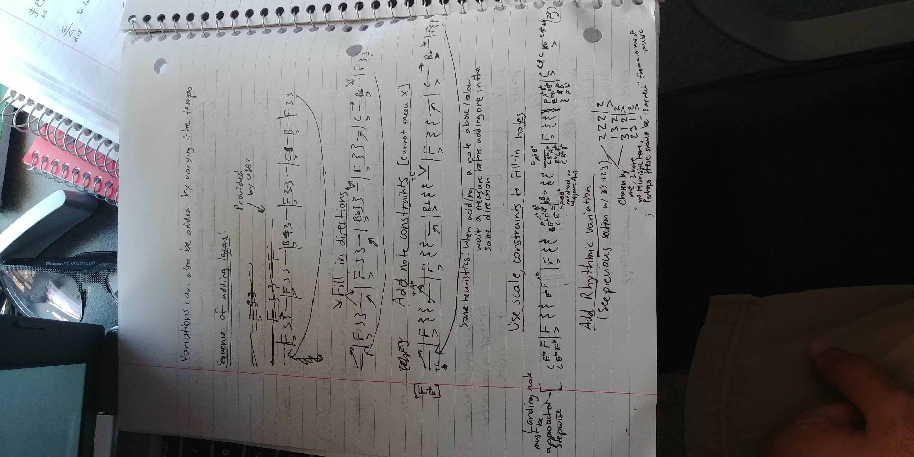

# notes-rajansaini691
Here's the [repo](https://github.com/rajansaini691/algorithmic_music) for all of my code (probabilistic chord and rhythm generation). Feel free to check it out and request features! 

## Melodic Generation Stream-of-Consciousness
Please note that these notes are quite unorganized, and they use a weird notation so that I could write faster.  Please scroll down to "Generation Process" to see a sequence of steps a program can follow in order to generate detailed variations based on a high-level sparse description.

### Generation Process
Main hope: A melody can be encoded by a rhythmic pattern and a scale (or set of scales). Here is how we can go from the pattern + scales to a full melody (in progress).

